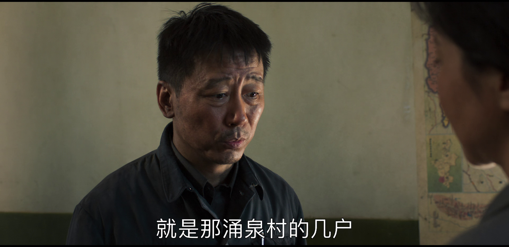

# Hardcoded Subtitles to SRT
Creates an
[SRT](https://www.matroska.org/technical/subtitles.html#srt-subtitles) file from
a video file that has hardcoded subtitles. For example,



will generate

```
57
00:03:20,200 --> 00:03:22,120
就是那涌泉村的几户
```

The script relies on [Tesseract](https://github.com/tesseract-ocr/tesseract) for
the optical character recognition.

## Dependencies
* [Python 3.9](https://www.python.org/downloads/)
* [Tesseract
  OCR](https://github.com/tesseract-ocr/tesseract#installing-tesseract)
  with support for your target language
* [pipenv](https://github.com/pypa/pipenv#installation)

To download the remaining python package dependencies, run
```
pipenv install
```

## How to use
To extract hardcoded subtitles from a video file run:
```
pipenv run python hard_subs_to_srt.py "path/to/video_file.mkv" "path/to/subtitles.srt"
```

This opens a GUI where you can see the script working on the video. Commands
that are available when running the video are:
* P - pause the subtitle extraction
* C - countinue the subtitle extraction if paused
* Q - stop the extraction and quit

For more information, have a look at the help documentation of the script by
running:
```
pipenv run python hard_subs_to_srt.py -h
```

Note that the script is currently locked for specific format of video input. To
get it working for your video you need to edit the script.